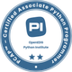

# Product Owner, Software Developer

Contact me: [LinkedIn](https://www.linkedin.com/in/danielbarty/) - [Xing](https://www.xing.com/profile/Daniel_Barty/)

### Work Experience
#### Product Owner | Quentic GmbH
- Stakeholder management in the ongoing sorftware migration process

#### Senior PHP Developer | BestSearchMedia (BestFewo)
- Concept and development for a high performant LivePrice service in search result lists
- Concept and development for a high performant data import system

### Education
- Data Scientist Python (in Progress)
- Scrum Product Owner and Scrum Master
- Fachinformatiker SI

### Certificates

<table>
  <tr>
    <td>
      
    </td>
    <td>
      
    </td>
    <td>
      
    </td>
    <td>
      
    </td>
  </tr>
</table>

### Languages and Tools

  &nbsp;
  &nbsp;
  &nbsp;
  &nbsp;
  &nbsp;
  &nbsp;
  &nbsp;
  &nbsp;
  &nbsp;

